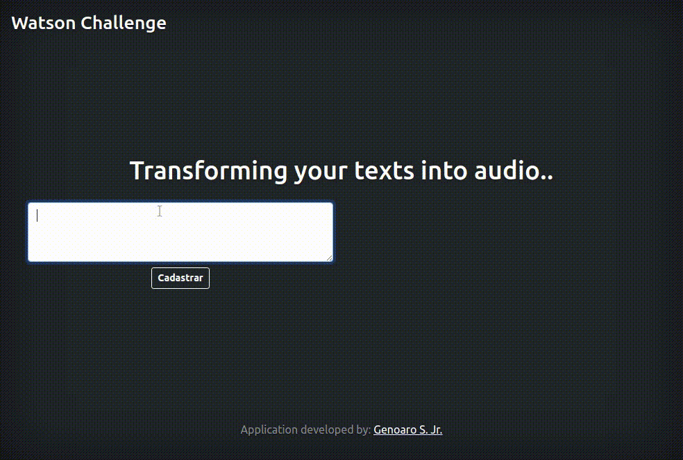

# Challenge - Smarkio (Text to Speech)

## What is the Smarkio (Text to Speech) challenge?
The Challenge - Smarkio (Text to Speech) is a challenge proposed by the company Smarkio - Itajubá, where the challenged must create an application using Node.js, MySql and Ajax. The application must receive a phrase, save it in the database, present it in the browser without reloading the page and, when clicking on a "listen" button, the IBM Text to Speech API must transform the chosen phrase into an audio.

## Home page



## Install dependencies
```sh
# To clone the project
git clone: https://github.com/GenoaroSJr/DesafioWatson.git

# Go to the project directory
cd DesafioWatson/

# Install dependencies
npm install
```

## Configuring database
```sh
# Configure .env: 
DB_HOST=(YOUR_HOST)
DB_USER=(YOUT_USER)
DB_PASS=(YOUR_PASS)

# Run migration:
npm run migration

The database is configured!
```
Note: In "configuring database", if necessary, use 'sudo';

## Run project 
```sh
# Start the server:
npm start

# See the project:
http://localhost:8081
```

2 - The application requests the integration of the "Watson Text to Speech" API, however, 
this part was not implemented until 1:15 am on February 1.


