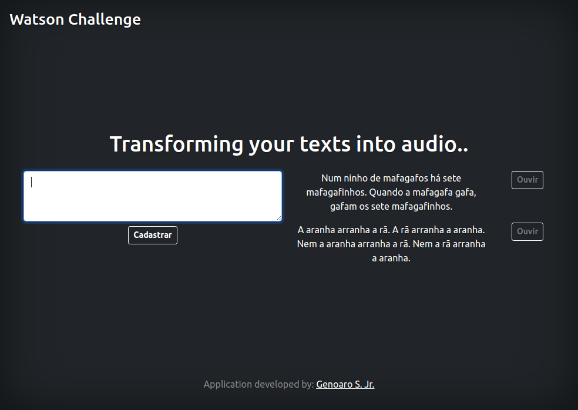

# Challenge - Smarkio (Text to Speech)

## What is the Smarkio (Text to Speech) challenge?
The Challenge - Smarkio (Text to Speech) is a challenge proposed by the company Smarkio - Itajubá, where the challenged must create an application using Node.js, MySql and Ajax. The application must receive a phrase, save it in the database, present it in the browser without reloading the page and, when clicking on a "listen" button, the IBM Text to Speech API must transform the chosen phrase into an audio.

## Home page



## Install dependencies
```sh
# To clone the project
git clone: https://github.com/GenoaroSJr/DesafioWatson.git

# Go to the project directory
cd DesafioWatson/

# Install dependencies
npm install
```

## Configuring database
Note: You must have xampp installed on the machine.

```sh
# Start localhost: 
../opt/lampp/lampp start

# Open localhost:
https://localhost/phpmyadmin/

# Create a database:
run the command: CREATE DETABASE comments

# Execute MigrationDB.sql
In the database "comments", go to "import", "Choose file", go to the 
DesafioWatson/ directory and choose the file MigrationDB.sql.

The database is configured!
```

## Run project 
```sh

# Start the server:
nodemon server.js

# See the project:
http://localhost:8081
```

## Notes
1 - DBConnection.js is configured for the "root" user and there is no password. 
If necessary, open the file and enter your user information.

```sh
../DesafioWatson/DBConnection.js
```

2 - The application requests the integration of the "Watson Text to Speech" API, however, 
this part was not implemented until 1:15 am on February 1.


